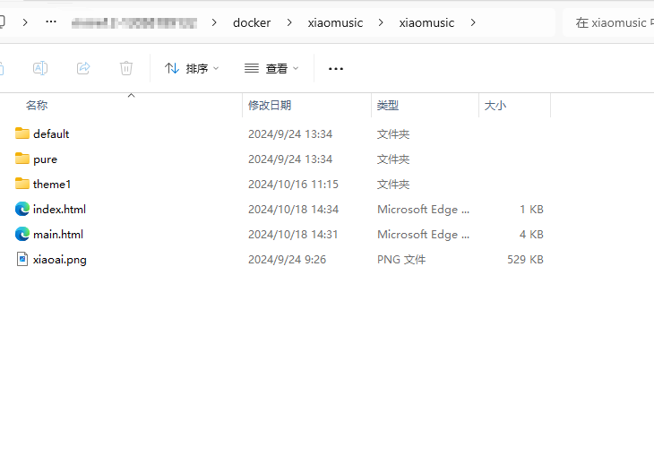
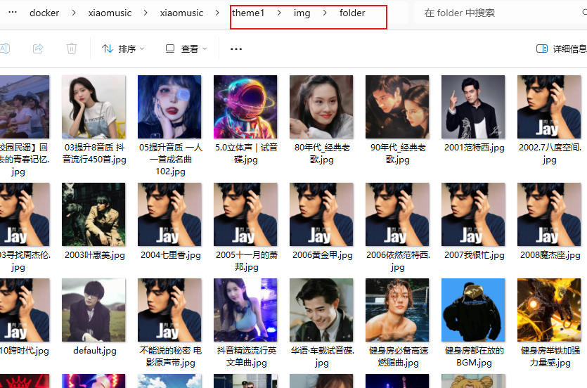

# xiaomusicui
> 该项目配合xiaomusic开源项目一起使用，xiaomusic地址[xiaomusic传送门](https://github.com/hanxi/xiaomusic)，使用该功能前请先使用docker部署好xiaomusic项目。感谢xiaomusic作者的无私奉献。

小爱音箱播放本地音乐前端界面适配

# 使用说明
## 1. 非docker运行
如果是非docker模式下部署的xiaomusic，下载对应版本的前端页面替换之前项目带的文件就好。

## 2. docker运行操作
1. 做docker目录映射，如下图：
 /app/xiaomusic/static

2. 下载当前页面里面的xiaomusic*.zip文件解压到映射的路径上。

3. 访问之前的后台地址，如果出现如下界面说明成功。

# 功能说明
> 软件操作非常简单就和我们的听歌播放器一样，功能就不再赘述。

## 1. 如何设置专辑图片
> 转到映射目录\theme1\img\folder，上传你想要设置的图片，名称和你的文件夹名字一样，后缀必须是.jpg文件。如果你不上传图片，系统也会给一个默认图片，设置好以后程序加载就会自动加载你设置好的图片。

# 项目展示
## 首页

## 推荐歌曲

## 推荐歌曲列表

## 播放界面

## 播放暂停界面

## 歌单界面

## 歌单详情界面

## 系统设置
