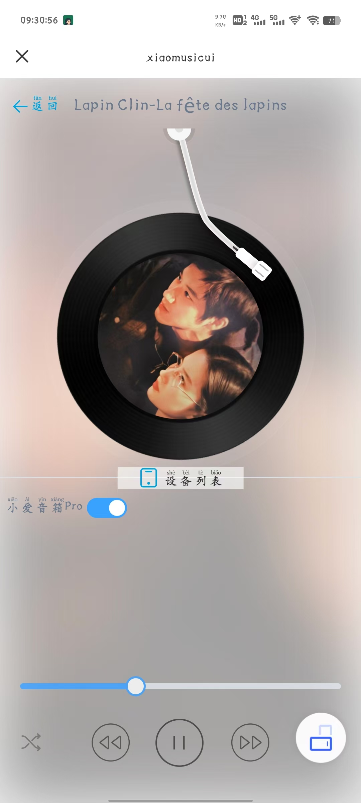
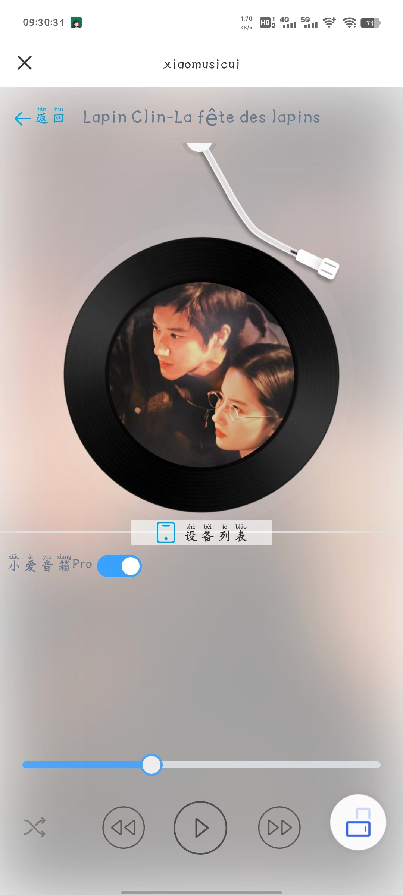
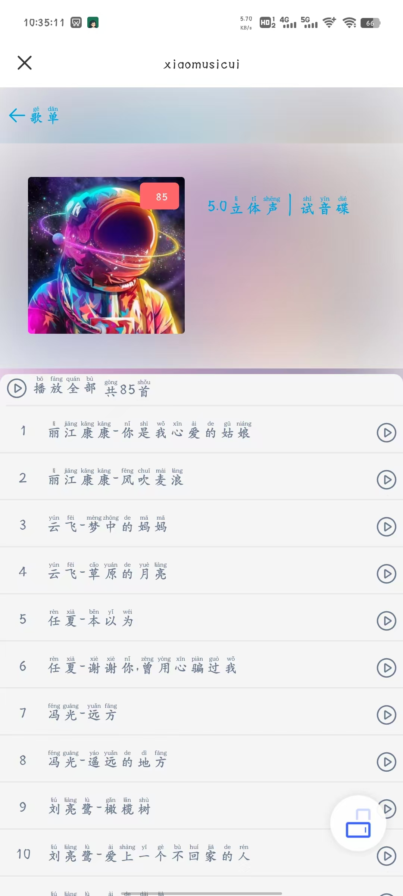
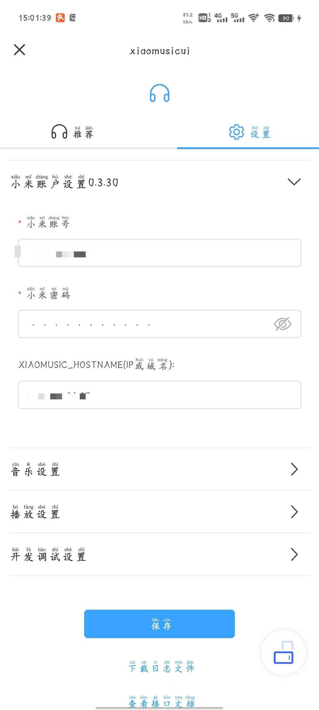

# xiaomusicui
> 该项目配合xiaomusic开源项目一起使用，xiaomusic地址[xiaomusic传送门](https://github.com/hanxi/xiaomusic)，使用该功能前请先使用docker部署好xiaomusic项目。感谢xiaomusic作者的无私奉献。

小爱音箱播放本地音乐前端界面适配

# 项目展示
## 首页

## 推荐歌曲

## 推荐歌曲列表

## 播放界面

## 播放暂停界面

## 歌单界面

## 歌单详情界面

## 系统设置
